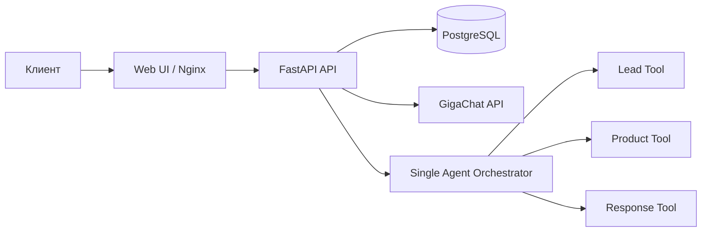

# AgroLead Assistant v5 (Single-Agent + GigaChat)

Легковесный B2B sales-assistant для низкоресурсного сервера (1 CPU / ~2 GB RAM).

Ключевой принцип текущей версии:

- один оркестратор-агент в API;
- детерминированный lead pipeline;
- LLM (GigaChat) формирует основную часть диалога по этапным промптам;
- в ответах запрещены повторяющиеся шаблонные формулировки.

## Быстрый запуск

```bash
git clone <repo-url>
cd agrolead-assistant
cp env.example .env
bash ./deploy.sh
```

После деплоя:

- Чат: `http://localhost:80`
- Админка: `http://localhost:80/admin`
- API docs: `http://localhost:8000/docs`

## Архитектура



## Сервисы Docker Compose

- `db` — PostgreSQL 16
- `api` — FastAPI + агент-оркестратор + state-machine + guardrails
- `webui` — Nginx + статический фронт

## Что убрано в v5

- NanoClaw transport и backend-адаптеры;
- Ollama runtime и pull-init сервис;
- недетерминированный путь lead extraction через LLM.

## LLM режим

Провайдер:

- `gigachat`

Дефолтные ограничения:

- `LLM_REQUEST_TIMEOUT_SECONDS=5`
- `LLM_MAX_RETRIES=1`
- одиночный inference-lock (без параллельной генерации)
- `GIGACHAT_VERIFY_SSL=1`
- `GIGACHAT_CA_FILE=/ssl/fullchain.pem` (если используется свой CA)
- `GIGACHAT_INSECURE_SSL_FALLBACK=1` (авто-фолбэк на insecure TLS для окружений с подменой цепочки)

## SSL и GigaChat

- Поместите подписанный CA-chain в `./ssl/fullchain.pem`; `deploy.sh` примонтирует `./ssl` внутрь контейнера `api`.
- В переменных окружения укажите `GIGACHAT_CA_FILE=/ssl/fullchain.pem` и `GIGACHAT_VERIFY_SSL=1`.

## Обязательные env для GigaChat

```env
LLM_PROVIDER=gigachat
GIGACHAT_AUTH_KEY=<base64-key-without-Basic-prefix>
GIGACHAT_SCOPE=GIGACHAT_API_PERS
GIGACHAT_AUTH_URL=https://ngw.devices.sberbank.ru:9443/api/v2/oauth
GIGACHAT_API_BASE_URL=https://gigachat.devices.sberbank.ru/api/v1
GIGACHAT_MODEL=GigaChat-2
GIGACHAT_VERIFY_SSL=1
GIGACHAT_CA_FILE=/ssl/fullchain.pem
GIGACHAT_INSECURE_SSL_FALLBACK=1
```

## Smoke-проверки в deploy.sh

Скрипт выполняет:

1. `/api/health`
2. `/api/chat/dry-run`
3. lead-сценарий из 3 сообщений с проверкой записи в БД (`status=qualified`)
4. запуск backend тестов (`unittest`)

При любой ошибке печатаются:

- logs контейнеров;
- тело падающего запроса/ответа;
- путь к полному deploy-логу.
