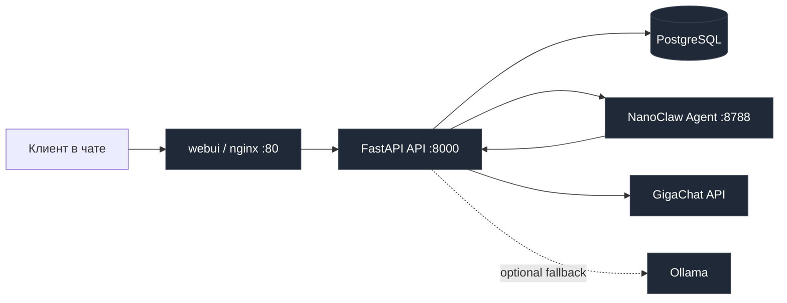

# AgroLead Assistant v3 (NanoClaw)

Полностью обновленный B2B sales-assistant для ООО «Петрохлеб-Кубань».

Проект мигрирован с PicoClaw на NanoClaw и готов к zero-config деплою: `git clone -> ./deploy.sh`.

## Что внутри

- Полная миграция на NanoClaw в отдельном контейнере `nanoclaw-agent`.
- FastAPI держит бизнес-логику: guardrails, state-machine, лиды, админку.
- LLM-стратегия: GigaChat как основной провайдер, Ollama как fallback (по флагу).
- Жесткая обработка токсичности и security-запросов.
- Честный `/api/llm/status`: показывает реального последнего провайдера и модель.

## Архитектура



## Запуск за 30 секунд

```bash
git clone <repo-url>
cd agrolead-assistant
cp .env.example .env
chmod +x deploy.sh
./deploy.sh
```

`deploy.sh` сам спросит только критичные секреты GigaChat, если они пустые.

## Сервисы

- `webui` — nginx, публичный чат и админка.
- `api` — FastAPI + SQLModel, вся бизнес-логика и интеграции.
- `db` — PostgreSQL 16.
- `nanoclaw-agent` — отдельный изолированный контейнер NanoClaw.
- `ollama` — опциональный fallback сервис (включается через `OLLAMA_FALLBACK_ENABLED=1`).

## Как работает LLM

1. Для генерации ответа API идет в NanoClaw-контейнер.
2. NanoClaw вызывает HTTP-адаптер: `POST /api/nanoclaw/agent/chat`.
3. В адаптере FastAPI вызывает `LLMService`.
4. `LLMService` пробует GigaChat первым.
5. Если включен fallback и GigaChat недоступен — использует Ollama.
6. В каждый ответ пишутся реальные `provider` и `model`.

Проверка статуса:

```bash
curl http://localhost:8000/api/llm/status
```

## State-machine диалога

Состояния: `greeting -> qualification -> offer -> handoff`.

Обязательные поля лида:

1. Товар
2. Класс
3. Объем
4. Регион
5. Срок
6. Контакт

Пока хоть одно поле пустое — бот задает один следующий точный вопрос.

## Guardrails (строго)

- Токсичность: короткий стоп-ответ, без продолжения анкеты.
- Сильная токсичность: диалог переводится в `stopped_toxic`.
- Кибер-запросы (`ddos`, `взлом`, `xss` и т.д.) — жесткий отказ.

## Примеры: до и после

### До (старый PicoClaw)

Клиент: `Да пошел ты...`

Бот: `Пожалуйста, уточните объем и регион поставки.`

### После (NanoClaw + guardrails)

Клиент: `Да пошел ты...`

Бот: `С таким тоном не работаю. Если нужен расчет по зерну, вернись с нормальным запросом.`

---

### После (квалификация)

Клиент: `Нужна пшеница 3 класс`

Бот: `Какой объем в тоннах нужен?`

Клиент: `200 тонн, Краснодар, отгрузка завтра, +7 900 111 22 33`

Бот: `Собрал параметры. Передаю менеджеру, он закрепит цену и логистику.`

## Что проверяет deploy.sh

- Жесткий wipe старых контейнеров/образов/volume и PicoClaw-артефактов.
- `git fetch --all && git reset --hard origin/main && git clean -fdx`.
- Подготовка `.env` + интерактивный запрос критичных секретов.
- Полная пересборка Docker-образов.
- Health & Integration Checks:
  - `/api/health`
  - `/api/llm/status` + проверка, что выбран GigaChat
  - PostgreSQL (`pg_isready`)
  - `/api/nanoclaw/agent/chat`
  - Ollama (если fallback включен)
  - 4 smoke-сценария диалогов
- Автотесты: `test_chat_stream.py` + `test_integration_dialogue.py`.

## Troubleshooting

### 1) Ошибка GigaChat credentials

Симптом: fail на `/api/llm/status` или `/api/chat/dry-run`.

Решение:

- Проверь `GIGACHAT_CLIENT_ID` и `GIGACHAT_CLIENT_SECRET` в `.env`.
- Если используешь `GIGACHAT_AUTH_KEY`, убедись что это base64(client_id:client_secret).
- Если в логах `403 Forbidden` на `/api/v2/oauth`, проверь `GIGACHAT_SCOPE` и доступы ключа.
- Если у тебя только Authorization key, заполни только `GIGACHAT_AUTH_KEY` (без префикса `Basic` и без `Authorization key:`), `GIGACHAT_CLIENT_SECRET` можно оставить пустым.
- Перезапусти: `./deploy.sh`.

### 2) Не стартует `nanoclaw-agent`

Симптом: fail на `/api/nanoclaw/agent/chat`.

Решение:

- Смотри логи: `docker logs --tail=100 agrolead-nanoclaw-agent`.
- Проверь `NANOCLAW_HTTP_ADAPTER_URL` в `.env`.

### 3) PostgreSQL недоступен

Симптом: fail на `pg_isready`.

Решение:

- Проверь `POSTGRES_*` переменные и `DATABASE_URL`.
- Смотри логи: `docker logs --tail=100 agrolead-db`.

### 4) Ollama check падает

Симптом: fail на `http://127.0.0.1:11434/api/tags`.

Решение:

- Убедись, что `OLLAMA_FALLBACK_ENABLED=1` только когда нужен fallback.
- Если fallback не нужен — поставь `OLLAMA_FALLBACK_ENABLED=0`.

### 5) GigaChat SSL certificate verify failed

Симптом: в логах API есть `CERTIFICATE_VERIFY_FAILED`, dry-run падает 503.

Решение:

- `deploy.sh` теперь автоматически переключает `GIGACHAT_VERIFY_SSL=0` и перезапускает API при такой ошибке.
- Если запускаешь вручную, выстави в `.env`: `GIGACHAT_VERIFY_SSL=0`.

## Полезные ссылки после деплоя

- Чат: `http://localhost:80`
- Админка: `http://localhost:80/admin`
- OpenAPI: `http://localhost:8000/docs`

Готово, можно работать.
