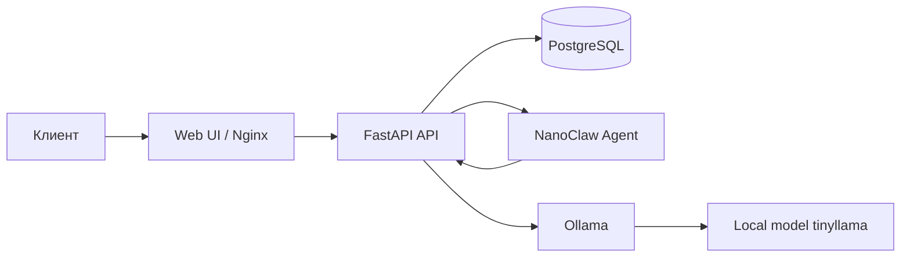

# AgroLead Assistant v4 (Local LLM)

Локальный B2B sales-assistant для ООО «Петрохлеб-Кубань» на микросервисной архитектуре.

Ключевой принцип текущей версии: **никаких внешних LLM API**, только локальная модель через Ollama.

## Быстрый запуск

```bash
git clone <repo-url>
cd agrolead-assistant
cp env.example .env
bash deploy/deploy.sh
```

После деплоя:

- Чат: `http://localhost:80`
- Админка: `http://localhost:80/admin`
- API docs: `http://localhost:8000/docs`

## Архитектура



## Сервисы

- `db` — PostgreSQL 16.
- `api` — FastAPI, state-machine, guardrails, лиды, админ API.
- `nanoclaw-agent` — изолированный адаптер агента (HTTP transport).
- `ollama` — локальный LLM runtime.
- `ollama-init` — one-shot сервис, который подтягивает модель перед стартом API.
- `webui` — Nginx + статический фронт.

## Почему раньше падало

1. Внешний провайдер LLM давал 403/SSL и валил dry-run.
2. Модель была слишком тяжелая для RAM сервера.
3. Большой `num_ctx` создавал лишнее потребление памяти.
4. Неподготовленная модель в Ollama приводила к 404/500 на генерации.

## Что исправлено

- Удалена интеграция с внешними LLM API, оставлен только Ollama.
- Дефолтная модель: `tinyllama` (влезает в ограниченные ресурсы).
- Безопасные дефолты для low-memory:
  - `OLLAMA_NUM_CTX=512`
  - `OLLAMA_NUM_PREDICT=96`
- `ollama-init` гарантирует `ollama pull` до старта API.
- `deploy.sh` автоматически снижает лимиты контекста при ошибке `requires more system memory`.
- `webui` теперь собирается отдельным образом, без bind-mounted `nginx.conf` и ошибок entrypoint.

## Параметры под сервер 4 GB RAM / 25 GB disk

Рекомендуемые значения уже в `env.example`:

```env
LLM_PROVIDER=ollama
OLLAMA_MODEL=tinyllama
OLLAMA_NUM_CTX=512
OLLAMA_NUM_PREDICT=96
OLLAMA_TEMPERATURE=0.15
```

Если RAM очень ограничена, можно дополнительно снизить:

```env
OLLAMA_NUM_CTX=256
OLLAMA_NUM_PREDICT=64
```

## Проверка после запуска

```bash
docker compose ps
curl -s http://localhost:11434/api/tags
curl -s http://localhost:8000/api/llm/status
curl -s -X POST http://localhost:8000/api/chat/dry-run \
  -H "Content-Type: application/json" \
  -d '{"text":"Нужна пшеница 3 класс 120 тонн в Краснодар"}'
```

Ожидаемо:

- `preferred_provider` = `ollama`
- dry-run возвращает `200` и непустой `text`

## Слабые места текущей архитектуры

- Нет очереди задач: все вызовы LLM идут напрямую через API.
- Нет отдельного сервиса для аналитики и событий диалогов.
- Нет централизованной конфигурации и секретов (Vault/KMS).
- Ограниченная отказоустойчивость при росте нагрузки.

## План улучшения для enterprise-интеграции

1. Ввести шину событий (NATS/RabbitMQ) для async-пайплайна.
2. Разделить API на bounded contexts:
   - `chat-service`
   - `lead-service`
   - `admin-service`
   - `inference-gateway`
3. Добавить `event-store` (Kafka/Postgres outbox) для аудита диалогов.
4. Вынести observability стек:
   - Prometheus + Grafana
   - Loki + structured logs
   - OpenTelemetry traces
5. Подключить SSO/RBAC и аудит-лог на уровне enterprise policy.
6. Добавить policy-engine (OPA) для guardrails и контуров доступа.

## Примечание

Текущая версия ориентирована на стабильный локальный запуск и демонстрацию в условиях ограниченных ресурсов. Для production в экосистеме предприятия следующий шаг — переход к событийному взаимодействию и централизованной observability/безопасности.
