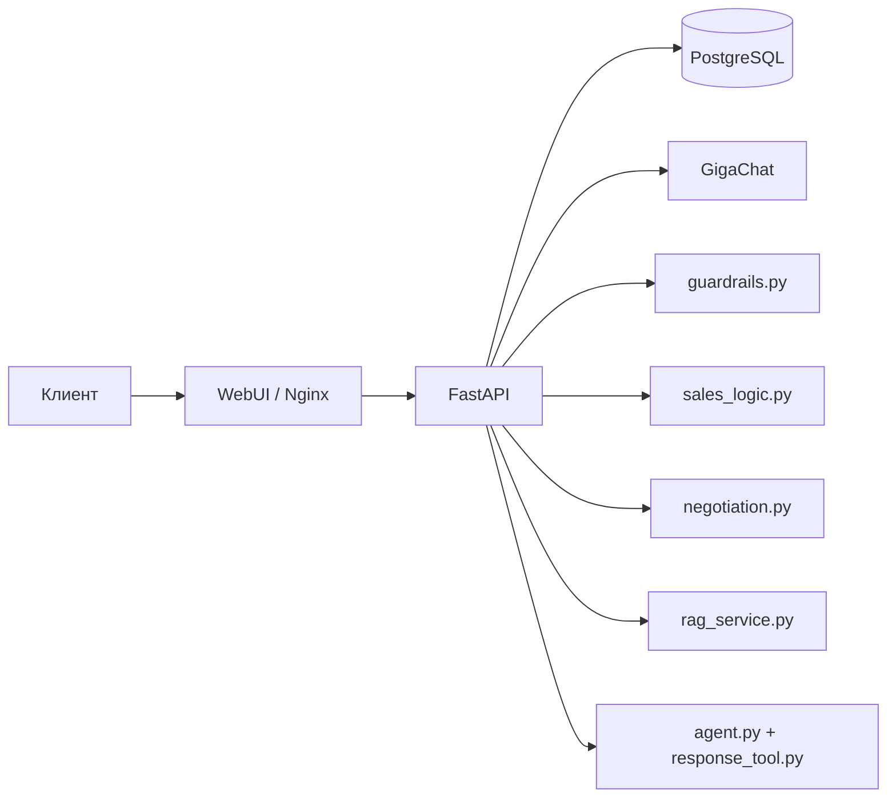

# 02. Архитектура и потоки

## 1) Текущий стиль архитектуры

Проект реализован как **модульный монолит**:

- один backend-сервис (FastAPI);
- одна БД;
- один webui (Nginx + статические страницы);
- LLM как внешний HTTP-провайдер.

## 2) Компоненты и ответственность

### Backend

- `main.py`
  - REST endpoints, auth-checks, CRUD, чат-оркестрация.
- `sales_logic.py`
  - определение типа запроса, парсинг фактов, required fields.
- `guardrails.py`
  - блок/разрешение запроса (токсичность и security abuse).
- `guardrail_response_policy.py`
  - шаблоны ответов при блокировках + anti-repeat.
- `negotiation.py`
  - определение стадии переговоров + оффер-гипотеза.
- `rag_service.py`
  - лексический retrieval по `knowledge_article`.
- `agent.py` + `tools/response_tool.py`
  - сбор system/user prompt и пост-обработка ответа.
- `llm_service.py` + `gigachat_client.py`
  - интеграция с GigaChat (OAuth, retries, timeout, fallback).
- `models.py`, `seed.py`, `security.py`, `db.py`
  - данные, сиды, безопасность, подключение к БД.

### Web

- `index.html`
  - чат с потоковым выводом NDJSON.
- `admin.html`
  - dashboard, реестр, workspace, справочники, настройки.
- `nginx.conf`
  - TLS-терминация, redirect 80->443, proxy на `/api/`.

## 3) Ключевой runtime-поток чата

Точка входа: `POST /api/v1/chat` (или `POST /api/chat`).

Основная последовательность:

1. Валидация входного текста.
2. Получение/создание `chat_session`.
3. Сохранение входящего сообщения в `chat_message`.
4. Guardrails (`evaluate_guardrails`).
5. Если блок: ответ policy-текстом и, при hard stop, перевод сессии в `blocked`.
6. Если норм: определение типа запроса (`detect_request_type`).
7. Синхронизация/создание лида (`crm_lead`, `crm_lead_item`, `crm_lead_contact_snapshot`).
8. Извлечение фактов (`extract_facts`), upsert в `chat_extracted_fact`.
9. Обновление `chat_missing_field` и статуса квалификации.
10. Поиск контекста из БЗ (`retrieve_knowledge_context`).
11. Формирование оффер-гипотезы (`build_offer_hypothesis`).
12. Сбор промпта и вызов LLM (`agent.reply`).
13. Сохранение ответа ассистента в `chat_message`.
14. Возврат итогового payload клиенту.

## 4) Поток работы менеджера

- Вход: `POST /api/v1/admin/login`.
- Токен хранится в `admin_session` (hash токена в БД).
- Админка загружает данные параллельно (`stats`, `leads`, каталоги и т.д.).
- Менеджер меняет статус/приоритет/ответственного через `PUT /api/v1/leads/{lead_id}`.
- Для deep dive по заявке используется workspace endpoint: `/api/v1/admin/leads/{lead_id}/workspace`.

## 5) Поток запуска приложения

При startup:

1. `init_db()` вызывает `SQLModel.metadata.create_all(engine)`.
2. `seed_defaults(session)` заполняет справочники, admin user, статьи знаний и тестовые каталоги.

При shutdown:

- закрывается HTTP-клиент LLM (`llm_service.close()`).

## 6) Архитектурные особенности легаси

- Основной сервисный файл `main.py` очень крупный (единый слой API + доменная логика).
- Многие операции читают полные таблицы в память и фильтруют в Python.
- Модель домена и контракты API смешаны (часто используются `dict[str, Any]`).
- Настройки intake/routing из админки частично не участвуют в runtime-логике backend.

## 7) Почему это работает сейчас

Для MVP объемов такой дизайн допустим:

- мало внешних зависимостей;
- быстрый старт без миграционного контура;
- правила прозрачны и читаемы;
- можно быстро вносить продуктовые правки.

Для роста трафика и команды этот подход уже становится узким местом (см. `docs/07-legacy-and-improvements.md`).
