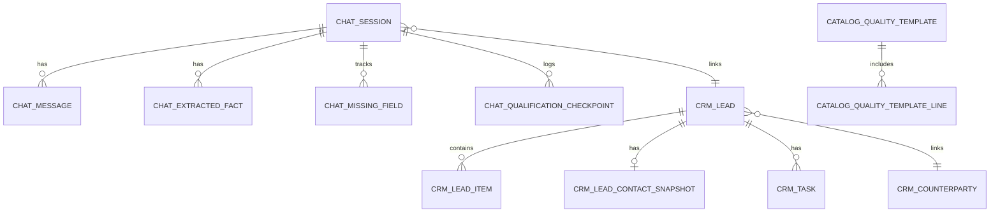

# 04. База данных и модель данных

## 1) Текущий механизм работы с БД

- ORM: `SQLModel`.
- Подключение: `backend/app/db.py`.
- Инициализация схемы: `SQLModel.metadata.create_all(engine)`.
- По умолчанию вне docker: `sqlite:////data/app.db`.
- В compose: PostgreSQL (`postgresql+psycopg://...@db:5432/agrolead`).

Критично: **миграций нет**. Изменения схемы сейчас контролируются только кодом и ручными действиями.

## 2) Группы таблиц

### Профиль компании

- `company_profile`.

### Справочники (`ref_*`)

- `ref_commodity`
- `ref_quality_parameter`
- `ref_delivery_basis`
- `ref_transport_mode`
- `ref_region`
- `ref_lead_source`
- `ref_counterparty_type`
- `ref_request_type`
- `ref_pipeline_stage`
- `ref_department`
- `ref_manager_role`

### Каталоги (`catalog_*`)

- `catalog_quality_template`
- `catalog_quality_template_line`
- `catalog_price_policy`
- `catalog_stock_placeholder`

### CRM (`crm_*`)

- `crm_counterparty`
- `crm_lead`
- `crm_lead_item`
- `crm_lead_contact_snapshot`
- `crm_lead_document_request`
- `crm_task`

### Чат (`chat_*`)

- `chat_session`
- `chat_message`
- `chat_extracted_fact`
- `chat_missing_field`
- `chat_qualification_checkpoint`

### Администрирование и настройки

- `admin_user`
- `admin_session`
- `admin_setting`

### База знаний

- `knowledge_article`

## 3) Логические связи (ER на уровне бизнес-правил)

Важно: в `models.py` много полей с id-ссылками, но явные `ForeignKey`/relationship почти не описаны. Целостность в основном держится бизнес-логикой приложения.

## 4) Ключевые таблицы (что хранится)

### `crm_lead`

- Базовая карточка заявки: тип запроса, источник, стадия, статус, приоритет, summary, next_action.
- Статусы: `draft`, `partially_qualified`, `qualified`, `handed_to_manager`, `closed`, `blocked`.

### `crm_lead_item`

- Предмет сделки: товар, объем, регионы, транспорт, базис, цена-цель, экспортный флаг.

### `crm_lead_contact_snapshot`

- Контакт на момент квалификации: компания/контактное лицо/каналы связи.

### `chat_extracted_fact`

- Каждый извлеченный факт из диалога:
  - `fact_key`
  - `fact_value_text`
  - `fact_value_numeric`
  - `confidence`
  - `source_message_id`

### `chat_missing_field`

- Список обязательных полей по конкретной сессии + признак собранности.

### `admin_session`

- Серверные сессии админки (хранится hash токена, срок, revoke, last_seen).

## 5) Seed-данные

`backend/app/seed.py` при startup заполняет:

- справочники (`ref_*`);
- профиль компании;
- admin пользователя;
- базовые `admin_setting`;
- пример шаблона качества, ценовой политики, лотов;
- статьи `knowledge_article`.

Seed выполняется при каждом запуске и работает как idempotent upsert (по `code`/`setting_key`/`login`).

## 6) Поток данных от сообщения до CRM

1. `chat_message` (вход).
2. `chat_extracted_fact` (структурированные факты).
3. `chat_missing_field` + `chat_qualification_checkpoint`.
4. `crm_lead`/`crm_lead_item`/`crm_lead_contact_snapshot`.
5. при наличии контакта создается/обновляется `crm_counterparty`.

## 7) Технические ограничения текущей модели

- Нет migration history и rollback-стратегии по схеме.
- Нет строгих FK-ограничений на многие id-поля.
- Нет версионирования фактов/карточки лида (только последнее состояние).
- Часть CRUD endpoint удаляет данные физически (например, delete commodity).
- Для аналитики не хватает исторических таблиц состояния лида.

## 8) Что важно сделать первым (по БД)

1. Ввести Alembic и базовую дисциплину миграций.
2. Добавить FK/индексы на критические связи (`lead_id`, `session_id`, `request_type_id`).
3. Укрепить уникальности и ограничения на бизнес-уровне.
4. Добавить аудит изменений по лидам/справочникам.
