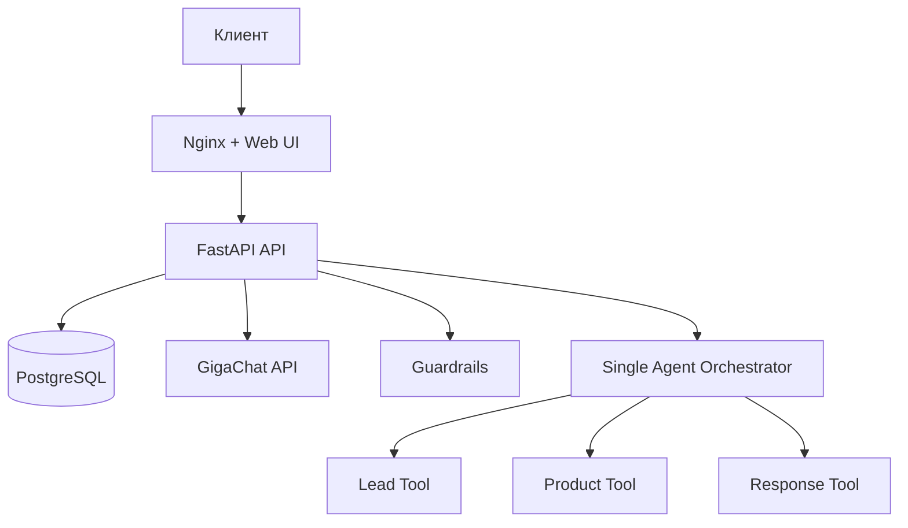

# Архитектура v5: single-agent orchestration

## Принципы

1. NanoClaw и Ollama полностью удалены из runtime-цепочки.
2. Все бизнес-решения по лиду выполняются детерминированно в backend.
3. Основной диалог формируется через GigaChat по этапным промптам (greeting/qualification/free_question/handoff).
4. Для снижения повторов в промпт передаются последние ответы ассистента с запретом дословного повтора.

## Поток запроса `/api/chat`

1. Guardrails: блок токсичных и security запросов.
2. `LeadTool` извлекает поля (regex + rules) и обновляет `ConversationState`.
3. Оркестратор формирует этапный промпт и отдает генерацию ответа GigaChat.
4. Если лид заполнен:
   - сохраняется запись `Lead` (status=`qualified`);
   - фиксируется `source_channel` и `raw_dialogue`;
   - возвращается финальный ответ handoff.
5. При недоступности LLM возвращается технический `service-unavailable` ответ без сценарных шаблонов.

## Ограничения производительности

- max timeout LLM = 5 секунд;
- `LLM_MAX_RETRIES=1`;
- inference выполняется через lock (без параллельной генерации);
- стек состоит из 3 сервисов: `api`, `db`, `webui`.
