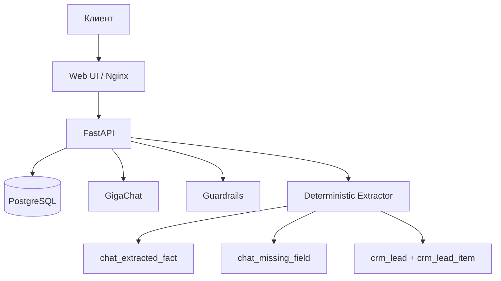

# Архитектура v6: sales assistant + backoffice

## Принципы

1. Конверсия в лид важнее свободной болтовни.
2. Этапы заявки и обязательные поля определяются backend-правилами.
3. Все промежуточные данные пишутся в SQL таблицы.
4. LLM используется только для естественной формулировки ответа.

## Поток `/api/v1/chat`

1. Guardrails (tox/security).
2. Детекция типа запроса (purchase/sale/logistics/storage/export/faq).
3. Извлечение фактов rule-based (культура, объем, регион, контакт и т.д.).
4. Upsert фактов в `chat_extracted_fact`.
5. Синхронизация черновика в `crm_lead` и `crm_lead_item`.
6. Пересчет `chat_missing_field` и выбор следующего вопроса.
7. Генерация короткого B2B-ответа через GigaChat.
8. Сохранение сообщения ассистента в `chat_message`.

## Слои данных

- Справочники: `ref_*`
- Каталоги: `catalog_*`
- CRM: `crm_*`
- Чат: `chat_*`
- Администрирование: `admin_*`, `knowledge_article`
