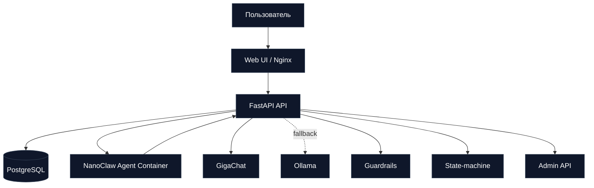

# Архитектура v3: NanoClaw + Zero-Config Deploy

## Главные принципы

1. NanoClaw живет в отдельном контейнере `nanoclaw-agent` с sandbox-настройками.
2. Связка с backend только через `POST /api/nanoclaw/agent/chat`.
3. LLM выбирается честно: сначала GigaChat, потом Ollama (если fallback включен).
4. Токсичность и security-запросы отсекаются до LLM.
5. Диалог идет по state-machine, без хаотичных ответов.

## Поток сообщения

1. Клиент пишет в веб-чат.
2. FastAPI проверяет guardrails.
3. Обновляется ConversationState + Lead.
4. Если лид неполный — state-machine задает следующий вопрос.
5. Если лид полный — API отправляет запрос в NanoClaw.
6. NanoClaw дергает backend-адаптер, который вызывает GigaChat.
7. Ответ возвращается в чат с реальным `provider/model`.
