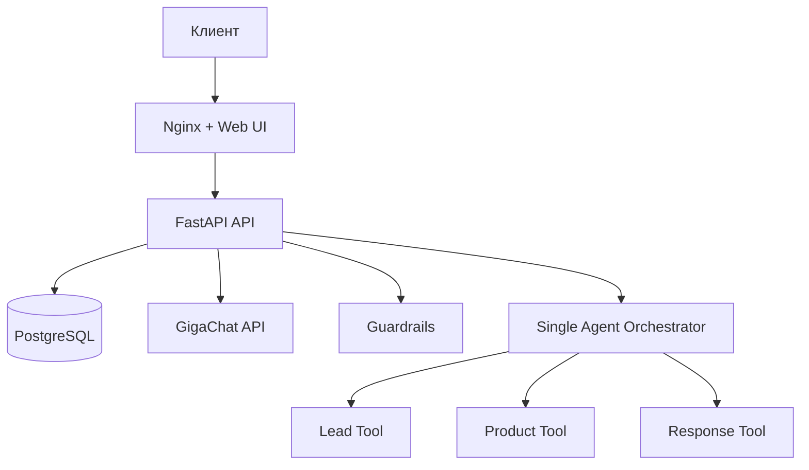

# Архитектура v5: single-agent orchestration

## Принципы

1. NanoClaw и Ollama полностью удалены из runtime-цепочки.
2. Все бизнес-решения по лиду выполняются детерминированно в backend.
3. LLM участвует только в двух задачах:
   - свободные вопросы клиента;
   - переписывание финального handoff-ответа.
4. При ошибках LLM ответ формируется шаблонами (template fallback).

## Поток запроса `/api/chat`

1. Guardrails: блок токсичных и security запросов.
2. `LeadTool` извлекает поля (regex + rules) и обновляет `ConversationState`.
3. Если обязательные поля отсутствуют - задается детерминированный следующий вопрос.
4. Если лид заполнен:
   - сохраняется запись `Lead` (status=`qualified`);
   - фиксируется `source_channel` и `raw_dialogue`;
   - возвращается финальный ответ (с optional LLM rewrite).
5. Для свободных вопросов вызывается LLM, при недоступности - template fallback.

## Ограничения производительности

- max timeout LLM = 5 секунд;
- `LLM_MAX_RETRIES=1`;
- inference выполняется через lock (без параллельной генерации);
- стек состоит из 3 сервисов: `api`, `db`, `webui`.
