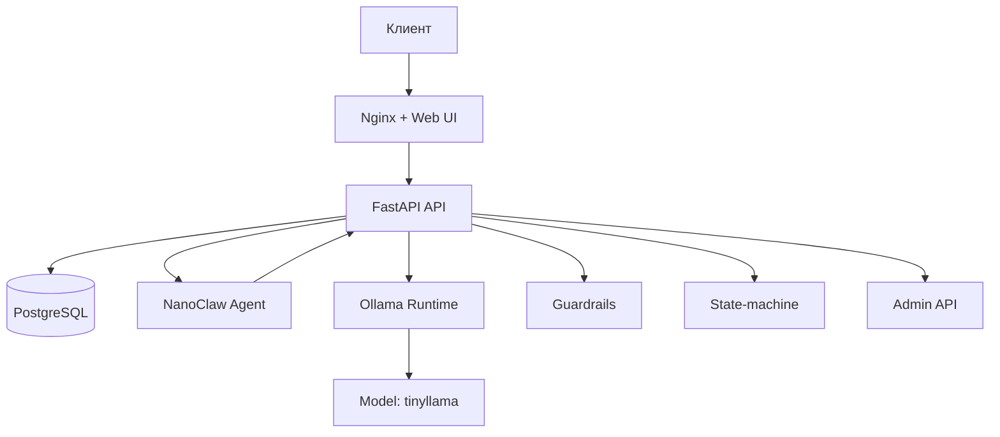

# Архитектура v4: локальная LLM-платформа

## Текущие принципы

1. Только локальная модель, без внешних облачных LLM.
2. NanoClaw работает отдельно и общается с backend по HTTP-адаптеру.
3. Диалог управляется state-machine, чтобы исключить хаотичную квалификацию.
4. Токсичность и security-запросы блокируются до вызова LLM.

## Поток запроса

1. Сообщение приходит в `webui`.
2. API проверяет guardrails и обновляет `ConversationState`.
3. Если данные лида неполные — state-machine задает следующий вопрос.
4. Если лид квалифицирован — API идет в `nanoclaw-agent`.
5. `nanoclaw-agent` дергает backend-адаптер `/api/nanoclaw/agent/chat`.
6. `LLMService` вызывает Ollama и возвращает ответ.

## Слабые места

- Синхронный inference-path без очередей.
- Нет отдельного inference-gateway и версионирования промптов по tenant.
- Нет выделенного event-stream для enterprise интеграций.

## Рекомендация для следующего этапа

- Добавить `inference-gateway` и `event-bus` (NATS/RabbitMQ).
- Ввести outbox pattern для лидов и чат-событий.
- Подключить централизованную телеметрию (metrics/logs/traces).
- Перейти на policy-driven guardrails с OPA/Rego.
