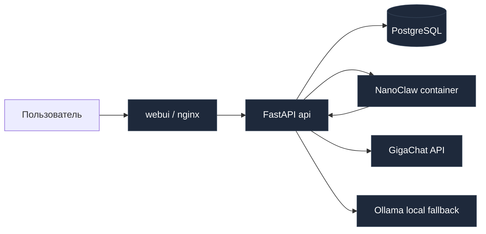

# Архитектура v2: NanoClaw-first

Проект мигрирован с PicoClaw на NanoClaw. Агентный рантайм теперь в отдельном изолированном контейнере.

## Mermaid

## Ключевые изменения

1. `NanoClaw` — основной агентный движок, HTTP-адаптер: `POST /api/nanoclaw/agent/chat`.
2. `FastAPI` хранит всю бизнес-логику: guardrails, state-machine, lead qualification.
3. LLM-стратегия строго `GigaChat -> Ollama fallback`.
4. `/api/llm/status` показывает **реального** последнего провайдера и модель.
5. Токсичные сообщения отрабатываются коротко, без продолжения вежливой анкеты.
